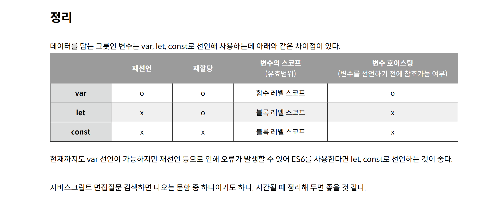

# TIL
- 자바스크립트 변수: 변수는 var,let,const 키워드를 사용하여 선언하고, 할당 연산자를 사용해 값을 할당한다.

var: ES5에서 변수를 선언할 수 있는 유일한 방법으로 한 번 선언된 변수명에 데이터를 재할당, 동일한 변수명으로 재선언 가능하다 하지만 단점들도 존재한다 일단 블록 스코프가 아니고 호이스팅 문제 중복선언 가능 실수로 전역 변수가 생기기 쉽다는 단점들이 있다 

let: 한번 선언된 변수명에 데이터를 재할당은 가능하나 동일한 변수명으로 재선언이 불가하다. 동일한 변수명으로 재선언이 불가해 변수명이 동일해 발생할 수 있는 문제를 미연에 방지할 수 있다. 그리고 호이스팅이 발생하지 않으며, 블록 레벨 스코프를 지원한다.

const: 변하지 않는 값 선언 시 사용한다. 변수를 선언하는 시점에 값을 할당하고, 값을 재할당하거나 동일한 변수명으로 재선언 둘 다 불가하다. let과 마찬가지로 호이스팅이 발생하지 않으며, 블록 레벨 스코프를 지원한다.

